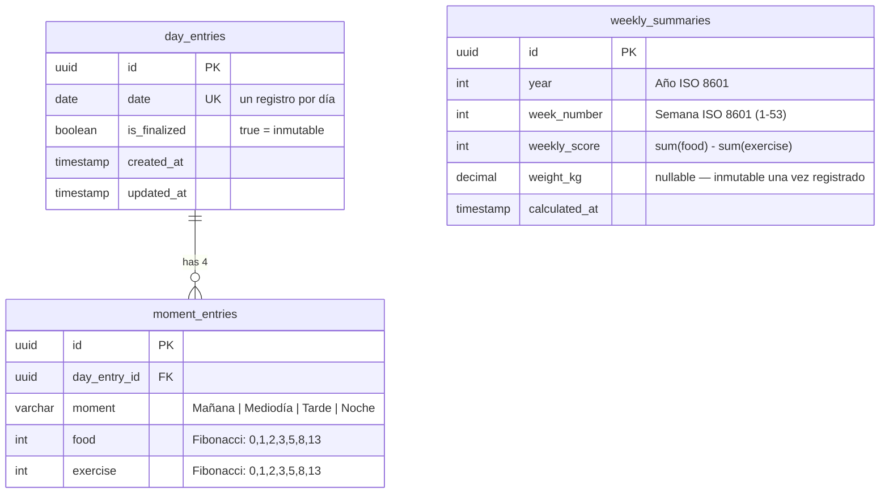

# Schema de base de datos

Base de datos: PostgreSQL 16. ORM: Entity Framework Core 8 con Npgsql.

## Diagrama ER

## Tablas

### day_entries

Representa un día de registro. Cada día tiene exactamente 4 `moment_entries`.

| Columna | Tipo | Restricciones | Descripción |
|---------|------|---------------|-------------|
| `id` | `uuid` | PK | Identificador único |
| `date` | `date` | NOT NULL, UNIQUE | Fecha del día (un registro por día) |
| `is_finalized` | `boolean` | NOT NULL, DEFAULT false | Si es `true`, el registro es inmutable |
| `created_at` | `timestamp` | NOT NULL | Fecha de creación (UTC) |
| `updated_at` | `timestamp` | NOT NULL | Última modificación (UTC) |

**Índices:**
- `PK` en `id`
- `UNIQUE` en `date`

---

### moment_entries

Representa uno de los 4 momentos del día (Mañana, Mediodía, Tarde, Noche).

| Columna | Tipo | Restricciones | Descripción |
|---------|------|---------------|-------------|
| `id` | `uuid` | PK | Identificador único |
| `day_entry_id` | `uuid` | FK → `day_entries.id`, NOT NULL | Día al que pertenece |
| `moment` | `varchar` | NOT NULL | Nombre del momento |
| `food` | `int` | NOT NULL, DEFAULT 0 | Valor Fibonacci de comida |
| `exercise` | `int` | NOT NULL, DEFAULT 0 | Valor Fibonacci de ejercicio |

**Índices:**
- `PK` en `id`
- `FK` en `day_entry_id` (cascade delete)

**Valores válidos para `food` y `exercise`:** `0, 1, 2, 3, 5, 8, 13`

---

### weekly_summaries

Resumen calculado por semana ISO. Se crea de forma lazy al acceder a la app si no existe para la semana actual.

| Columna | Tipo | Restricciones | Descripción |
|---------|------|---------------|-------------|
| `id` | `uuid` | PK | Identificador único |
| `year` | `int` | NOT NULL | Año ISO 8601 |
| `week_number` | `int` | NOT NULL | Número de semana ISO (1–53) |
| `weekly_score` | `int` | NOT NULL | `sum(food) - sum(exercise)` de la semana |
| `weight_kg` | `decimal` | NULL | Peso corporal (inmutable una vez registrado) |
| `calculated_at` | `timestamp` | NOT NULL | Momento del cálculo (UTC) |

**Índices:**
- `PK` en `id`
- `UNIQUE` en `(year, week_number)`

## Reglas de negocio relevantes al schema

- Un `day_entry` con `is_finalized = true` no puede ser modificado por ningún endpoint.
- Un `weekly_summary` con `weight_kg IS NOT NULL` no puede recibir un nuevo peso.
- El `weekly_score` se calcula una sola vez (lazy) y no se recalcula automáticamente si se agregan días posteriores a la misma semana.
- Las semanas siguen el estándar ISO 8601: comienzan el lunes y terminan el domingo.
